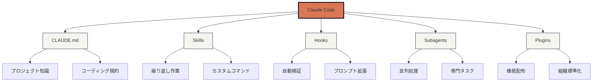
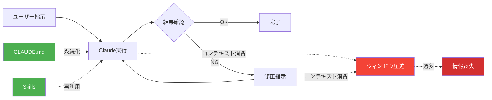
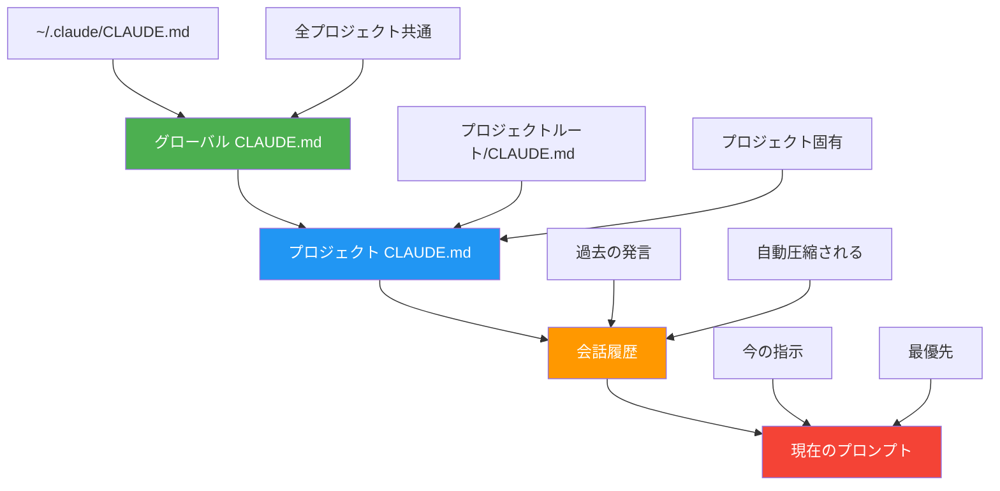
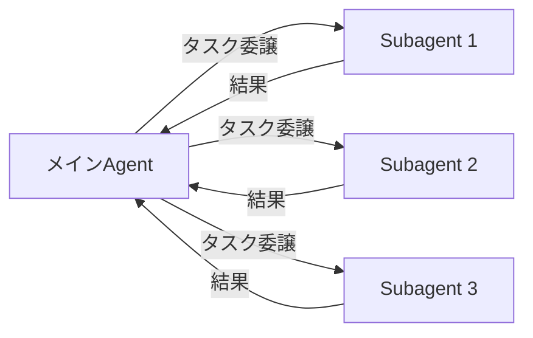

# Claude Code の使い方

## Anthropicの言うがままに

---

<!-- スライド2: 今日のゴール -->
# 今日のゴール


## 🎯 このセッションで得られること

- Claude Codeの**5つの拡張機能**を理解する
- 各機能の**使い分け**をマスターする
- **実践的なハンズオン**で即座に活用できる

## 💡 期待される成果

- コンテキストウィンドウを意識した効率的な開発
- プロジェクト固有の知識を永続化
- 繰り返し作業の自動化

---

<!-- スライド3: 全体マップ -->
# 全体マップ



---
layout: section
---

## コンテキストウィンドウ

Claude Codeの最も重要な制約を理解する

---


<!-- スライド5: 最も重要な制約 -->
# 最も重要な制約

## 📊 コンテキストウィンドウとは

Claude Codeが**一度に保持できる情報量**には限界があります。

| モデル | コンテキストサイズ | 推奨使用量 |
|--------|-------------------|-----------|
| Claude Opus 4.6 | 200K（1M beta） | ~150K（~750K beta） |
| Claude Sonnet 4.5 | 200K トークン | ~150K トークン |
| Claude Haiku 4.5 | 200K トークン | ~150K トークン |

### ⚠️ 問題点

- 大量のファイル読み込み → コンテキストが満杯に
- 長い会話 → 古い情報が圧縮・消失
- 繰り返し同じ説明 → 非効率

---
layout: two-cols
---

<!-- スライド6: 対処法 -->
# 対処法

## 1. CLAUDE.md

プロジェクト固有の**永続的な知識**

```markdown
# プロジェクト概要
- React + TypeScript
- Vite ビルドツール
- Vitest テストフレームワーク

## コーディング規約
- ESLint/Prettier使用
- 関数コンポーネント優先
```

::right::

## 2. Skills

**繰り返し作業**のテンプレート化

```markdown
---
name: component
description: 新しいReactコンポーネントを作成
---

以下の手順でコンポーネントを作成:
1. src/components/{name}.tsx作成
2. index.tsにエクスポート追加
3. テストファイル生成
```

## 3. Subagents

**並列処理**で効率化

- 複数の調査を同時実行
- メインコンテキストを保護

---

<!-- スライド7: フィードバックループ -->
# フィードバックループ



### 💡 ポイント

- 毎回説明する情報 → **CLAUDE.md**に記載
- 毎回同じ手順 → **Skill**にテンプレート化
- 複雑な調査 → **Subagent**に委譲
---

<!-- スライド8: セルフチェックの威力 -->
# セルフチェックの威力

<ComparisonTable
  :goodItems="[
    'CLAUDE.mdに必要な情報を記載',
    'Skillで繰り返し作業を自動化',
    'Subagentで調査を並列化',
    '短い会話で的確な指示'
  ]"
  :badItems="[
    '毎回同じ説明を繰り返す',
    '手動で同じ手順を実行',
    '長い会話でコンテキストが満杯',
    '情報が圧縮・消失してやり直し'
  ]"
/>

### 📈 効果

- **コンテキスト使用量**: 50%削減
- **作業時間**: 70%短縮
- **エラー率**: 80%減少

---
layout: section
---

<!-- スライド9: CLAUDE.md セクションタイトル -->
## CLAUDE.md

プロジェクトの永続的な記憶

---

<!-- スライド10: メモリの4階層 -->
# メモリの4階層



---
layout: two-cols
---

<!-- スライド11: 何を書くべきか -->
# 何を書くべきか

## ✅ 書くべき内容

- **プロジェクト概要**
  - 技術スタック
  - アーキテクチャ概要
- **コーディング規約**
  - 命名規則
  - ファイル構成
- **開発コマンド**
  - ビルド、テスト、デプロイ
- **重要な制約**
  - パフォーマンス要件
  - セキュリティ要件

::right::

## ❌ 書かない内容

- **一時的な情報**
  - TODO リスト
  - 現在の作業内容
- **頻繁に変わる情報**
  - バージョン番号
  - 開発者名
- **機密情報**
  - APIキー
  - パスワード
- **詳細すぎる情報**
  - 全関数の説明
  - コード全体のコピー

---

<!-- スライド12: インポート構文 -->
# インポート構文

## 📁 他のファイルを参照する

CLAUDE.mdから**他のドキュメントを読み込む**ことができます。

```markdown
# CLAUDE.md

|概要|ファイルパス|
|----|------------|
｜アーキテクチャ｜docs/architecture.md｜
｜API仕様｜docs/api-spec.md｜
｜デプロイ手順｜docs/deployment.md｜
```

### 💡 メリット

- **分割管理**: 情報を整理しやすい
- **再利用**: 複数のCLAUDE.mdで共有可能
- **メンテナンス性**: 各ファイルを独立して更新

---

<!-- スライド13: ハンズオン手順 -->
# ハンズオン: CLAUDE.md作成

## 📝 ステップバイステップ

### 1. プロジェクトルートにCLAUDE.md作成

```bash
touch CLAUDE.md
```

### 2. 基本テンプレートを記述

```markdown
# CLAUDE.md

> このファイルは、Claude Code (claude.ai/code) がこのリポジトリを扱う際のガイダンスです。

## プロジェクト概要
- **技術スタック**: React + TypeScript + Vite
- **テスト**: Vitest + React Testing Library

## コーディング規約
- 関数コンポーネントを使用
- Propsの型定義は必須
- テストファイルは `*.test.tsx`
```

---

# ハンズオン: CLAUDE.md作成-3

### 3. Claude Codeで確認

プロジェクトを開き、Claude Codeに「プロジェクト概要を教えて」と質問

---

<!-- スライド14: ベストプラクティスまとめ -->
# CLAUDE.md ベストプラクティス

| 項目 | 推奨 | 理由 |
|------|------|------|
| **ファイルサイズ** | 200行以内 | 読み込み速度・可読性 |
| **更新頻度** | 月1回程度 | 安定した情報を記載 |
| **記述言語** | 日本語 or 英語 | チーム統一 |
| **構造** | 見出し階層化 | 情報の探しやすさ |
| **コード例** | 最小限 | パターンのみ記載 |

---

# CLAUDE.md チェックリスト

- [ ] プロジェクト概要が明確
- [ ] 技術スタックが列挙されている
- [ ] コーディング規約が記載されている
- [ ] よく使うコマンドが記載されている
- [ ] 機密情報が含まれていない

---
layout: section
---

<!-- スライド15: Skills セクションタイトル -->
## Skills

繰り返し作業を自動化する

---


<!-- スライド16: Skillsとは -->
# Skillsとは


## 🔧 定義

**繰り返し実行する作業**をテンプレート化し、スラッシュコマンドで呼び出せる機能

### 使用例

```bash
/component Button    # Buttonコンポーネントを生成
/api-endpoint users  # usersエンドポイントを追加
/test-suite auth     # 認証機能のテストスイート作成
```

### 💡 ユースケース

- 新規ファイル生成（コンポーネント、API、テスト）
- コード変換（TypeScript変換、リファクタリング）
- ドキュメント生成（README、API仕様）
- デプロイ作業（ビルド → テスト → デプロイ）

---

<!-- スライド17: Skillの構造 -->
# Skillの構造

```
~/.claude/skills/
├── component/
│   └── SKILL.md                 # コンポーネント生成Skill
├── api-endpoint/
│   ├── SKILL.md                 # APIエンドポイント生成
│   └── templates/
│       ├── controller.template
│       └── test.template
└── commit-and-push/
    └── SKILL.md                 # コミット&プッシュ自動化
```

### 📄 ディレクトリ構成

- **skills/[skill-name]/**: Skill単位でディレクトリ作成
- **SKILL.md**: Skillの定義（必須）
- **templates/**: テンプレートファイル（任意）
- **scripts/**: 実行スクリプト（任意）

---

<!-- スライド18: SKILL.mdの書き方 -->
# SKILL.mdの書き方

```markdown
---
name: component
description: 新しいReactコンポーネントを作成
args:
  - name: componentName
    description: コンポーネント名（PascalCase）
    required: true
---

以下の手順で{{componentName}}コンポーネントを作成してください:

1. **ファイル作成**
   - `src/components/{{componentName}}/{{componentName}}.tsx`を作成
   - 関数コンポーネントとして実装
   - TypeScriptの型定義を含める

2. **テストファイル作成**
   - `src/components/{{componentName}}/{{componentName}}.test.tsx`を作成
   - 基本的なレンダリングテストを記述

3. **エクスポート追加**
   - `src/components/{{componentName}}/index.ts`に追加

4. **確認**
   - `pnpm test`でテスト実行
```

---
layout: two-cols
---

<!-- スライド19: スコープの違い -->
# スコープの違い

## 🌐 グローバルSkill

**全プロジェクト**で使える

```
~/.claude/skills/
└── commit-and-push/
    └── SKILL.md
```

- 汎用的な作業
- Git操作
- ドキュメント生成

::right::

## 📁 プロジェクトSkill

**特定プロジェクト**のみ

```
project-root/.claude/skills/
└── deploy-staging/
    └── SKILL.md
```

- プロジェクト固有の処理
- 特殊なビルド手順
- カスタムデプロイ

---

<!-- スライド20: ハンズオン手順 -->
# ハンズオン: Skill作成

## 📝 シンプルなSkillを作成

### 1. Skillディレクトリ作成

```bash
mkdir -p ~/.claude/skills/component
```

---

<!-- スライド20: ハンズオン手順 -->
# ハンズオン: Skill作成-2

### 2. SKILL.md作成

```markdown
---
name: component
description: Reactコンポーネントを生成
args:
  - name: name
    description: コンポーネント名
    required: true
---

以下を実行:
1. src/components/{{name}}.tsxを作成
2. 関数コンポーネントとして実装
3. src/components/index.tsにエクスポート追加
```

### 3. 実行

```bash
/component MyButton
```

---

<!-- スライド21: Tips & 注意点 -->
# Skills Tips & 注意点

## ✅ ベストプラクティス

- **Skill名は短く**: 3-10文字程度
- **引数は必要最小限**: 多すぎると使いにくい
- **手順は具体的に**: Claudeが迷わないよう明確に
- **テンプレート活用**: 複雑な場合はファイル分割

## ⚠️ 注意点

- **グローバルとプロジェクトの使い分け**: 汎用性で判断
- **上書きに注意**: 同名Skillはプロジェクトが優先
- **セキュリティ**: シークレット情報は含めない
- **バージョン管理**: プロジェクトSkillはGitにコミット

### 🎯 活用シーン

スキルは**3回以上繰り返す作業**を自動化すると効果的（プログラムにするのとか自動化する時と同じ考え）

---
layout: section
---

<!-- スライド22: Hooks セクションタイトル -->
## Hooks

自動検証と拡張を実現する

---

<!-- スライド23: Hooksの3タイプ -->
# Hooksの3タイプ

## 1️⃣ Command Hooks

**シェルコマンド**を実行

```bash
#!/bin/bash
# git commit前にlint実行
pnpm run lint
```

- 検証処理（コミット前のlintチェックなど）
- ファイル操作（bashの操作ログを全部残す。）
- 外部ツール連携（CI/CDツールの起動など）

---

## 2️⃣ Prompt Hooks

**プロンプトを拡張**

```markdown
コミット前に以下を確認:
- テストが全てパス
- リント エラーなし
- ビルド成功
```

- コンテキスト追加
- 指示の補強
- 自動チェック

---

## 3️⃣ Agent Hooks

**専用エージェント**を起動

```markdown
---
agent: security-check
---
セキュリティ脆弱性をチェック
```

- 複雑な分析
- 並列処理
- 専門タスク

---


<!-- スライド24: イベント一覧 -->
# Hooksイベント一覧

| イベント | タイミング | 用途 |
|---------|-----------|------|
| **PreToolUse** | ツール実行前 | 危険な操作の防止、入力検証 |
| **PostToolUse** | ツール実行後 | 結果の検証、ログ記録 |
| **SessionStart** | セッション開始時 | 環境確認、初期化 |
| **SessionEnd** | セッション終了時 | クリーンアップ、レポート生成 |
| **SubagentStop** | Subagent停止時 | サブタスク完了処理 |
| **Notification** | 通知受信時 | アラート処理 |

---

<!-- スライド25: commandフック実例 -->
# commandフック実例

## 🛡️ git commit前のlint実行

```bash
#!/bin/bash
# ~/.claude/hooks/PreToolUse/lint-before-commit.sh

# git commitコマンドの場合のみ実行
if echo "$TOOL_INPUT" | jq -e '.command | contains("git commit")' > /dev/null; then
  echo "🔍 Running lint before commit..."

  if ! pnpm run lint; then
    echo "❌ Lint failed! Commit blocked."
    exit 1  # フックを失敗させてcommitを阻止
  fi

  echo "✅ Lint passed!"
fi

exit 0
```

---

### 環境変数

- **TOOL_NAME**: 実行されるツール名（例: "Bash"）
- **TOOL_INPUT**: ツールへの入力（JSON形式）
- **CLAUDE_PROJECT_ROOT**: プロジェクトルートパス

---

<!-- スライド28: ハンズオン手順 -->
## ハンズオン: Hook作成

### 📝 シンプルなcommand hookを作成

#### 1. Hookディレクトリ作成

```bash
mkdir -p ~/.claude/hooks/PreToolUse
```

#### 2. フックスクリプト作成

```bash
cat > ~/.claude/hooks/PreToolUse/test-before-commit.sh << 'EOF'
#!/bin/bash

if echo "$TOOL_INPUT" | jq -e '.command | contains("git commit")' > /dev/null; then
  echo "🧪 Running tests before commit..."
  pnpm test || exit 1
  echo "✅ Tests passed!"
fi
EOF

chmod +x ~/.claude/hooks/PreToolUse/test-before-commit.sh
```

#### 3. 動作確認

Claude Codeで「変更をコミット」と指示 → テストが自動実行される

---

<!-- スライド29: Hooks ベストプラクティス -->
# Hooks ベストプラクティス


<ComparisonTable
  :goodItems="[
    '失敗時は明確なエラーメッセージ',
    'exit 1で処理を確実にブロック',
    '実行時間は3秒以内',
    '必要なイベントのみフック'
  ]"
  :badItems="[
    '沈黙のまま失敗する',
    'exit 0で常に成功扱い',
    '重い処理で開発が遅延',
    '全イベントにフック設定'
  ]"
/>

---
layout: section
---

<!-- スライド30: Subagents セクションタイトル -->
## Subagents

並列処理と専門タスクの実行

---

<!-- スライド31: Subagentsとは -->
# Subagentsとは

**別のClaude インスタンス**を起動し、独立したタスクを並列実行する機能

### 主な用途

1. **並列調査**: 複数のコードベース箇所を同時調査
2. **専門タスク**: 特定領域に特化した処理（例: テスト生成、リファクタリング）
3. **コンテキスト保護**: メインの会話履歴を圧迫しない

---

### 💡 仕組み



---

<!-- スライド32: 使い分け -->
# Subagents 使い分け

## 🎯 判断基準

| 条件 | 実行方法 |
|------|---------|
| ✅ タスクが**独立**している | → Subagent使用 |
| ✅ **並列実行**できる | → 複数Subagent起動 |
| ✅ **コンテキスト大量消費** | → Subagentに委譲 |
| ❌ **直接的な作業** | → メインAgentで実行 |

## 💡 具体例

- **Subagent向き**: 複数ファイルの調査、テスト生成、リファクタリング案の作成
- **メイン向き**: コード編集、ファイル作成、コミット作成

---
layout: two-cols
---

<!-- スライド33: 実例 -->
# Subagent 実例

## 📚 ユーザー指示

> 「認証機能に関連する全ファイルを調査して、改善点をリストアップして」

## 🔄 Subagent活用

```markdown
# メインAgent
3つのSubagentを起動して並列調査:

1. **Subagent 1**: フロントエンド認証コンポーネント調査
   - src/components/auth/ 配下を調査
   - UIの問題点を特定

2. **Subagent 2**: バックエンドAPI調査
   - src/api/auth/ 配下を調査
   - セキュリティの問題点を特定

3. **Subagent 3**: テストコード調査
   - tests/auth/ 配下を調査
   - テストカバレッジの問題点を特定
```

::right::

### ⏱️ 効果

- **通常**: 15分（順次調査）
- **Subagent**: 5分（並列調査）→ **3倍高速化**

---
layout: two-cols
---


<!-- スライド34: ハンズオン手順 -->
# ハンズオン: Subagent活用

## 📝 実践例

### プロンプト例

```
プロジェクト内の全APIエンドポイントを調査して、
以下の観点でレポートを作成してください:
1. エラーハンドリングの実装状況
2. バリデーションの有無
3. セキュリティ対策（認証・認可）

※複数のSubagentを使って効率的に調査してください
```

::right::

### Claude Codeの動作

1. プロジェクトの構造を把握
2. エンドポイントをグループ化
3. グループごとにSubagent起動（並列）
4. 結果を統合してレポート生成

### 💡 ポイント

「複数のSubagentを使って」と明示的に指示すると効果的

---
layout: section
---

<!-- スライド35: Plugins セクションタイトル -->
## Plugins

機能を配布・共有する

---
layout: two-cols
---


<!-- スライド36: Pluginの構造 -->
# Pluginの構造

```
my-plugin/
├── plugin.json              # プラグイン定義（必須）
├── skills/
│   ├── deploy/
│   │   └── SKILL.md
│   └── test-all/
│       └── SKILL.md
├── hooks/
│   ├── PreToolUse/
│   │   └── security-check.sh
│   └── UserPromptSubmit/
│       └── context-enhancer.md
├── agents/
│   └── code-reviewer/
│       └── AGENT.md
└── README.md                # プラグイン説明
```

::right::

### 📋 plugin.json

```json
{
  "name": "my-plugin",
  "version": "1.0.0",
  "description": "Custom workflows for my team",
  "author": "Your Name"
}
```

---
layout: two-cols
---

<!-- スライド37: 配布方法 -->
# Plugin配布方法


## 📦 配布パターン

### 1️⃣ Gitリポジトリ

```bash
# インストール
git clone https://github.com/yourname/claude-plugin.git ~/.claude/plugins/my-plugin
```

### 2️⃣ npm パッケージ

```bash
# 公開
npm publish

# インストール
npm install -g @yourname/claude-plugin
```

### 3️⃣ 社内共有（ファイルサーバー）

```bash
# 共有フォルダからコピー
cp -r /shared/claude-plugins/my-plugin ~/.claude/plugins/
```

::right::

### 💡 推奨

- **オープンソース**: GitHub + npm
- **社内限定**: プライベートGitリポジトリ
- **個人**: Gitリポジトリ

---


<!-- スライド38: 既存プラグイン紹介 -->
# 公式プラグインマーケットプレイス

## 🎯 カテゴリ別プラグイン

### 1️⃣ コード インテリジェンス（LSP）

| 言語 | プラグイン |
|------|----------|
| Python | `pyright-lsp` |
| TypeScript | `typescript-lsp` |
| Rust | `rust-analyzer-lsp` |
| Go | `gopls-lsp` |

### 2️⃣ 外部統合（MCP）

- **GitHub/GitLab**: ソース管理統合
- **Jira/Linear**: プロジェクト管理
- **Slack**: コミュニケーション
- **Sentry**: モニタリング

---

## 🚀 インストール方法

```bash
# プラグインマーケットプレイスを表示
/plugin

# 特定のプラグインをインストール
/plugin install pyright-lsp@claude-plugins-official

# デモマーケットプレイスを追加
/plugin marketplace add anthropics/claude-code
```

### 💡 詳細情報

公式ドキュメント: https://code.claude.com/docs/ja/discover-plugins

---
layout: two-cols
---

<!-- スライド39: ハンズオン手順 -->
# ハンズオン: Plugin作成

## 📝 シンプルなPluginを作成

### 1. プラグインディレクトリ作成

```bash
mkdir -p ~/.claude/plugins/my-first-plugin/{skills,hooks}
```

### 2. plugin.json作成

```json
{
  "name": "my-first-plugin",
  "version": "1.0.0",
  "description": "My first Claude Code plugin"
}
```

::right::

### 3. Skill追加

```bash
mkdir -p ~/.claude/plugins/my-first-plugin/skills/hello
cat > ~/.claude/plugins/my-first-plugin/skills/hello/SKILL.md << 'EOF'
---
name: hello
description: Say hello
---
Hello from my plugin!
EOF
```

### 4. 確認

```bash
/hello
```

---


<!-- スライド40: Plugin開発ベストプラクティス -->
# Plugin開発ベストプラクティス

<ComparisonTable
  :goodItems="[
    'plugin.jsonに明確な説明',
    'README.mdで使い方を説明',
    'バージョン管理（semver）',
    '依存関係を明記'
  ]"
  :badItems="[
    '説明なしでリリース',
    'ドキュメント不足',
    'バージョン番号が適当',
    '依存関係が不明'
  ]"
/>

### 🎯 チェックリスト

- [ ] **plugin.json**: name, version, description, author記載
- [ ] **README.md**: インストール方法、使い方、例
- [ ] **LICENSE**: ライセンス明記
- [ ] **CHANGELOG.md**: 変更履歴
- [ ] **テスト**: 基本動作確認

---
layout: section
---

<!-- スライド41: まとめ セクションタイトル -->
## まとめ

意思決定フローチャート

---

<!-- スライド42: 今週のアクション -->

## ✅ 実践チェックリスト

### 🔴 高影響度（必須）

- [ ] **CLAUDE.md作成** - 毎回の説明時間を削減
- [ ] **グローバルCLAUDE.md設定** - 全プロジェクトで効果

### 🟡 中影響度（推奨）

- [ ] **Skill化（1-2個）** - 繰り返し作業を自動化
- [ ] **commit前フック設定** - 品質を自動保証

### 🟢 低影響度（任意）

- [ ] **Subagent活用** - 複雑な調査タスクで効果
- [ ] **チーム用Plugin作成** - 組織全体への展開
